<!-- omit in toc -->
# sample_bluetooth_connect

FlutterでBLE通信を行う方法を確認する

## 1. 使用するパッケージ

| パッケージ        | 説明                                                                 |
| ----------------- | -------------------------------------------------------------------- |
| flutter_blue_plus | 更新が途絶えている flutter_blue の後継として開発されているパッケージ |
|                   |                                                                      |

### 1.1. flutter_blue_plus

[flutter_blue_plus](https://pub.dev/packages/flutter_blue_plus)

## 概要



## HM-10

```code
#include <SoftwareSerial.h>

 SoftwareSerial mySerial(10, 11);

 void setup()
 {
    mySerial.begin(9600);
    Serial.begin(9600);
    delay(100);
 }

 void loop()
 {
    if (Serial.available() > 0) {
      mySerial.write(Serial.read());
    }
    if (mySerial.available() > 0) {
      Serial.write(mySerial.read());
    }       
 }
```

```command
AT
AT+HELP
AT+LADDR
AT+UUID
AT+CHAR
```

```code
OK
********************************************************************
* Command             Description			           *
* ---------------------------------------------------------------- *
* AT                  Check if the command terminal work normally  *
* AT+RESET            Software reboot				   *
* AT+VERSION          Get firmware, bluetooth, HCI and LMP version *
* AT+HELP             List all the commands		           *
* AT+NAME             Get/Set local device name                    *
* AT+PIN              Get/Set pin code for pairing                 *
* AT+BAUD             Get/Set baud rate		                   *
* AT+LADDR            Get local bluetooth address		   *
* AT+ADDR             Get local bluetooth address		   *
* AT+DEFAULT          Restore factory default			   *
* AT+RENEW            Restore factory default			   *
* AT+STATE            Get current state				   *
* AT+PWRM             Get/Set power on mode(low power) 		   *
* AT+POWE             Get/Set RF transmit power 		   *
* AT+SLEEP            Sleep mode 		                   *
* AT+ROLE             Get/Set current role.	                   *
* AT+PARI             Get/Set UART parity bit.                     *
* AT+STOP             Get/Set UART stop bit.                       *
* AT+INQ              Search slave model                           *
* AT+SHOW             Show the searched slave model.               *
* AT+CONN             Connect the index slave model.               *
* AT+IMME             System wait for command when power on.	   *
* AT+START            System start working.			   *
* AT+UUID             Get/Set system SERVER_UUID .            	   *
* AT+CHAR             Get/Set system CHAR_UUID .            	   *
* -----------------------------------------------------------------*
* Note: (M) = The command support master mode only. 	           *
+LADD=3881D71B219C
+UUID=FFE0
+CHAR=FFE1
```
