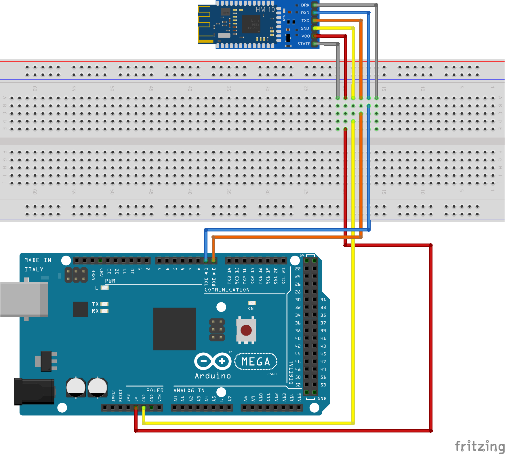
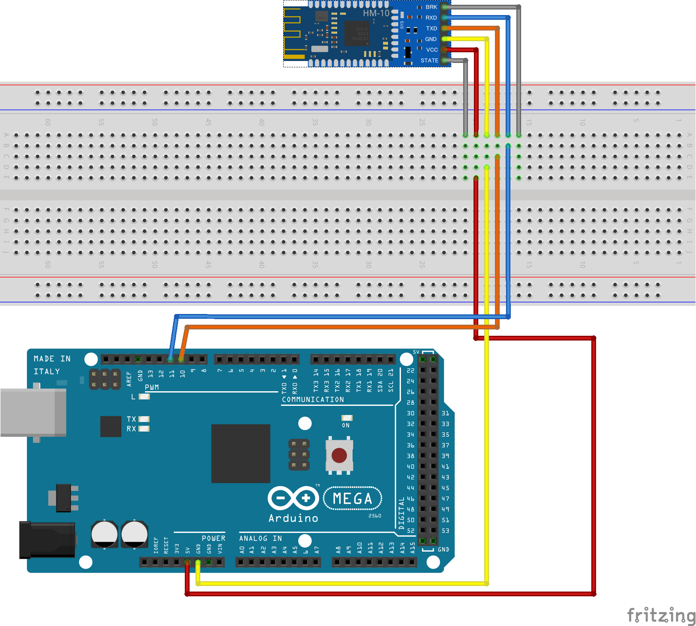

<!-- omit in toc -->
# sample_bluetooth_connect

BLE通信をFlutterで実験する
↓実際の様子

[Flutter+Arduino+HM-10](https://youtu.be/63eFdtSA3NM)

## 1. 構成

### 1.1. Bluetooth機器

Bluetooth機器は Arduino Mega 2560 と HM-10で作成する
ブレッドボード図を以下に示す



Arduino Mega へ書き込むスケッチは[ここ](arduino/hm-10_test.ino)を参照

### 1.2. Flutterアプリ

#### 1.2.1. 使用パッケージ

- [flutter_blue_plus](https://pub.dev/packages/flutter_blue_plus)
- [hooks_riverpod](https://pub.dev/packages/hooks_riverpod)
- [flutter_hooks](https://pub.dev/packages/flutter_hooks)
- [go_router](https://pub.dev/packages/go_router)

#### 1.2.2. 操作方法

操作方法を下図に示す


## 2. 参考

### 2.1. HM-10の使用方法

#### 2.1.1. ボード作成

下図に従い、Arduino Mega と HM-10 を接続する



#### 2.1.2. スケッチの書き込み

Arduino IDEを起動し、Arduino Mega に以下のスケッチを書き込む

```code
#include <SoftwareSerial.h>

 SoftwareSerial mySerial(10, 11);

 void setup()
 {
    mySerial.begin(9600);
    Serial.begin(9600);
    delay(100);
 }

 void loop()
 {
    if (Serial.available() > 0) {
      mySerial.write(Serial.read());
    }
    if (mySerial.available() > 0) {
      Serial.write(mySerial.read());
    }       
 }
```

> **Tips**
> スケッチ例は[ここ](arduino/hm-10_test.ino)を参照

#### 2.1.3. ATコマンドの実行

Arduino IDE のシリアルモニタを開き、以下のコマンドを順に送信する

```command
AT
AT+LADDR
AT+UUID
AT+CHAR
```

コマンドの結果として、以下のようにメッセージが表示されることを確認する

```code
OK
+LADD=3881D71B219C
+UUID=FFE0
+CHAR=FFE1
```

それぞれのコマンドとメッセージの意味を下表に示す

| コマンド | メッセージ         | 意味                          |
| -------- | ------------------ | ----------------------------- |
| AT       | OK                 | ATコマンド受付状態            |
| AT+LADDR | +LADD=3881D71B219C | MacAddress                    |
| AT+UUID  | +UUID=FFE0         | BLEサービスのID               |
| AT+CHAR  | +CHAR=FFE1         | BLEキャラクタリスティクスのID |

> **Tips**
> コマンドの詳細は[HM-10 DataSheet](https://people.ece.cornell.edu/land/courses/ece4760/PIC32/uart/HM10/DSD%20TECH%20HM-10%20datasheet.pdf)を参照

#### 2.1.4. BLE通信の実行

ATコマンドの結果を元に以下の観点でBLE通信を行う
※詳細はFlutterアプリを参照

- MacAddressによって接続する HM-10 が判別できる
- BLEサービス/キャラクタリスティクスのIDによって利用するサービス/キャラクタリスティクスが判別できる

### 2.2. 参考リンク

- [Bluetooth Low Energy Tutorial with HM-10 BLE 4.0 & Arduino](https://how2electronics.com/bluetooth-low-energy-tutorial-with-hm-10-ble-4-0-arduino/)
- [HM-10 BLE 4.0 & Arduino を使用した Bluetooth Low Energy チュートリアル](https://www.youtube.com/watch?v=MV7EUEoc9dI)
